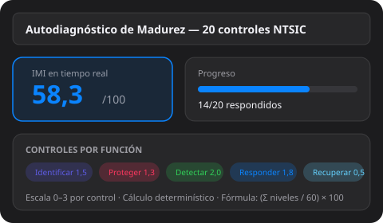
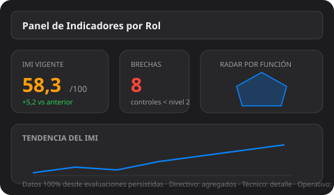
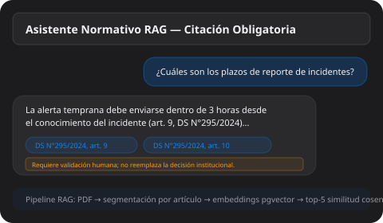

# 🛡️ ÉGIDA — Maqueta de Demostración

<div align="center">


**Portal de Autogestión de Madurez y Cumplimiento Normativo en Ciberseguridad para órganos de la Administración del Estado de Chile**

[🌐 **Ver demo en vivo →**](https://jarayaa.github.io/egida-demo/)

*ACIF3003 — Proyecto de Innovación | UNAB — Jaime Araya Aros*

</div>

---

## 📖 ¿Qué es esta maqueta?

Una **vitrina funcional** del portal ÉGIDA que corre directamente en el navegador, sin backend ni base de datos. Demuestra las capacidades núcleo del sistema:

- 🎯 Autodiagnóstico de 45 controles (Anexo A NCh-ISO 27001.Of2009, alineados a las funciones NTSIC del DS N°7/2023) con cálculo real del IMI
- 🕸️ Malla normativa interactiva: grafo de los 20 controles por función NTSIC con resaltado de la cadena de dependencias
- 📊 Panel de indicadores con gráfico de telaraña (radar) por función NTSIC y KPIs (IMI, controles en nivel objetivo, brechas)
- 🤖 Asistente normativo RAG con citación obligatoria (conectado al chatbot del MVP validado)
- 🔐 Simulación de roles (Directivo, Técnico, Operativo) asignados por correo

> **Nota:** La versión funcional completa (autenticación JWT, persistencia, informes PDF, auditoría) se ejecuta con `docker compose` desde el [repositorio privado](https://github.com/jarayaa/EGIDA) y está desplegada en **https://egida.uk**.

---

## 📊 Módulos del Portal

### 1. Autodiagnóstico de Madurez

<div align="center">



</div>

Evalúe los **45 controles** del Anexo A NCh-ISO 27001.Of2009 (set ampliado, 9 por función), organizados por las 5 funciones del DS N°7/2023 (Identificar, Proteger, Detectar, Responder, Recuperar). El **Índice de Madurez Institucional (IMI)** se calcula en tiempo real con la fórmula determinística:

```
IMI = (Σ niveles / 135) × 100    [45 controles × 3; escala 0–100, 1 decimal]
```

---

### 2. Malla Normativa

Los **20 controles críticos** se organizan por las 5 funciones NTSIC (Identificar, Proteger, Detectar, Responder, Recuperar). Las flechas representan una **secuencia sugerida de implementación**: para alcanzar un control conviene tener implementado el que lo precede. Al hacer clic en un control se resalta su cadena de prerrequisitos y dependientes.

> **Interpretación metodológica propia de ÉGIDA.** La NCh-ISO 27001.Of2009 no define un orden de implementación entre sus controles; esta secuencia de dependencias es una sugerencia de remediación del proyecto y **no constituye orden normativo ni exigencia legal**.

En la versión funcional, la malla se implementa con React Flow e incluye los modos **Norma**, **Comparador** (equivalencias entre ediciones ISO) y **Evaluación** (superpone su nivel de madurez sobre el grafo).

---

### 3. Panel de Indicadores por Rol

<div align="center">



</div>

Visualice el estado de madurez de su organismo con indicadores diferenciados por perfil:

| Rol | Vista |
|-----|-------|
| **Directivo** | IMI agregado, tendencia, total de brechas |
| **Técnico (RIS/RAI)** | Detalle completo: controles, niveles, recomendaciones |
| **Operativo** | Solo lectura de evaluaciones completadas |

---

### 4. Asistente Normativo con Citación Obligatoria

<div align="center">



</div>

Consulte la normativa chilena en **lenguaje natural**. El asistente responde exclusivamente desde el corpus indexado, con:

- ✅ **Citas verificables**: tipo de instrumento correcto (DS, Resolución, Norma, Ley) + artículo exacto
- ✅ **Condiciones habilitantes**: plazos del DS N°295/2024 con sus condiciones (ej.: 24 h solo si OIV con servicios esenciales afectados)
- ✅ **Verificación OIV**: búsqueda difusa contra la nómina de la Res. Ex. N°87/2025 ANCI
- ✅ **Rechazo fuera de dominio**: frase exacta si la consulta no está cubierta por el corpus
- ✅ **Advertencia asistiva**: toda respuesta requiere validación humana

---

## 🔐 Roles disponibles en la maqueta

El perfil se asigna automáticamente por el correo ingresado:

| Correo | Rol asignado |
|--------|:---:|
| `ris@organismo.gob.cl` | Técnico (RIS/RAI) |
| `jefe@organismo.gob.cl` | Directivo |
| `operador@organismo.gob.cl` | Operativo |
| Cualquier otro | Técnico (default) |

---

## 🏗️ Tecnología

| Aspecto | Detalle |
|---------|---------|
| Archivo | `index.html` único, autocontenido (~51 KB, logo medallón embebido en data URI) |
| Backend | No requiere — todo corre en el navegador |
| Cálculos | IMI determinístico en JavaScript (replica backend) |
| Malla | Grafo SVG por bandas NTSIC con resaltado de dependencias (vanilla JS) |
| Panel | Gráfico de telaraña (radar) SVG + KPIs, dibujado en el navegador |
| Asistente | iframe del chatbot Chatbase del MVP validado + modo offline |
| Tema visual | macOS dark, translúcidos, acento #0a84ff, paleta NTSIC del sitio real |
| Accesibilidad | WCAG AA (contraste, labels, foco) |

---

## 🔗 Enlaces

| | |
|---|---|
| 🌐 **Demo en vivo** | [jarayaa.github.io/egida-demo](https://jarayaa.github.io/egida-demo/) |
| 🔒 **Producción** | [egida.uk](https://egida.uk) |
| 📁 **Repositorio principal** | [github.com/jarayaa/EGIDA](https://github.com/jarayaa/EGIDA) (privado) |
| 🏫 **MVP no-code** | [portal-ntsic-mvp.softr.app](https://portal-ntsic-mvp.softr.app) |

---

## 📜 Normativa implementada

- **DS N°7/2023** — Norma Técnica de Seguridad de la Información y Ciberseguridad (NTSIC)
- **DS N°295/2024** — Reporte obligatorio de incidentes de ciberseguridad
- **Res. Ex. N°7/2025 ANCI** — Taxonomía de incidentes
- **Res. Ex. N°87/2025 ANCI** — Nómina de Operadores de Importancia Vital (OIV)
- **NCh-ISO 27001.Of2009** — Controles del Anexo A

---

<div align="center">

**ACIF3003 — Proyecto de Innovación en Ingeniería Civil Informática**

Universidad Andrés Bello | 2026

🛡️ *Bajo la égida de la ciberseguridad* 🛡️

</div>
